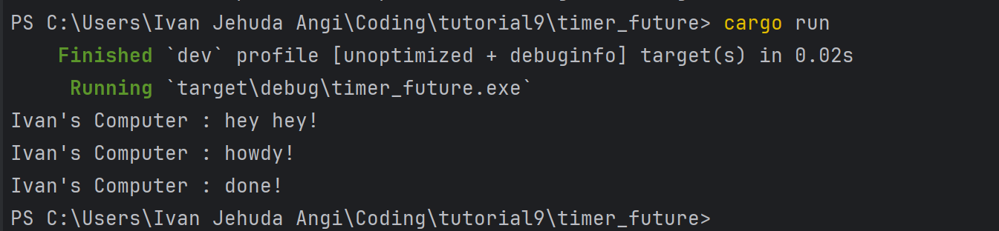

#  Module 9 Reflection
Ivan Jehuda Angi - 2306152222 - Advance Programming A

## Understanding How It Works

In asynchronous programming, instructions don’t run one after another in a strict order. In this example, the `main()` function first sets up an executor and a spawner, then uses the spawner to launch an asynchronous task. However, calling spawn doesn’t immediately start the task — the command to run it hasn’t been issued yet. Next, `main()` outputs "Spawner has been called, task will run asynchronously." to indicate the task is scheduled but not running yet. Then, `main()` prints "hey hey" before anything else. The spawned task only begins execution when the executor is started at the end, which causes it to print "howdy!" after a two-second delay, followed by "done!". This sequence happens because the executor manages the asynchronous task, while the commands in `main()` run first.

