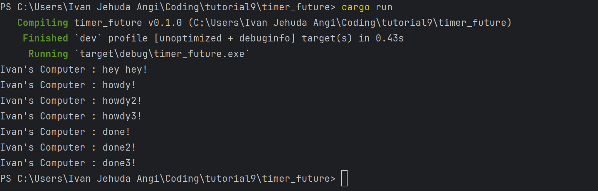
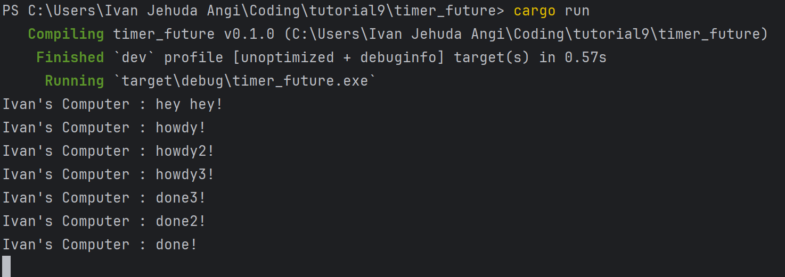

#  Module 10 Reflection
Ivan Jehuda Angi - 2306152222 - Advance Programming A

## Understanding How It Works

In asynchronous programming, instructions don’t run one after another in a strict order. In this example, the `main()` function first sets up an executor and a spawner, then uses the spawner to launch an asynchronous task. However, calling spawn doesn’t immediately start the task — the command to run it hasn’t been issued yet. Next, `main()` outputs "Spawner has been called, task will run asynchronously." to indicate the task is scheduled but not running yet. Then, `main()` prints "hey hey" before anything else. The spawned task only begins execution when the executor is started at the end, which causes it to print "howdy!" after a two-second delay, followed by "done!". This sequence happens because the executor manages the asynchronous task, while the commands in `main()` run first.

---

## Multiple Spawn and Removing Drop
### a. Multipler spawn

### b. Removing `drop(spawner)`

In this example, the spawner is invoked three times, launching three separate tasks that run concurrently on different threads. The printing order, especially the "hey hey" messages, reflects the sequence in which the spawner was called, so the output will consistently show `howdy1`, `howdy2`, `howdy3`, followed by `done1`, `done2`, and `done3`. These tasks run in parallel without waiting for one another to finish. The `drop(spawner)` call signals to the executor that no additional tasks will be created, allowing it to stop waiting for new tasks. Without calling `drop(spawner)`, the program keeps running because the executor anticipates more tasks; with it, the program ends after all tasks complete, as the executor knows no further tasks are coming.

